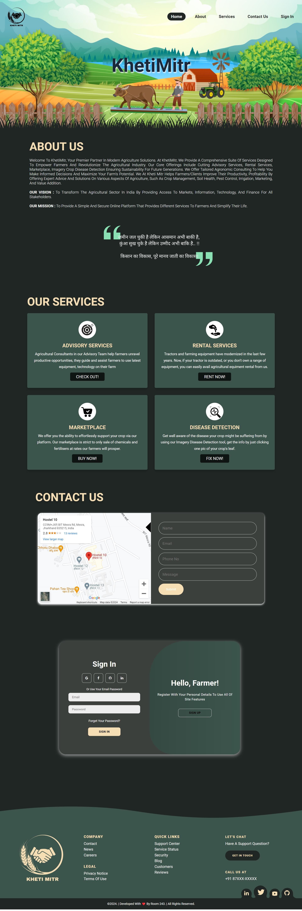

# KhetiMitr (Updated)

## Overview
KhetiMitr is a comprehensive platform designed to address various agricultural challenges faced by farmers and clients. The platform aims to enhance crop management, pest control, soil health, irrigation, and marketing, ultimately boosting agricultural productivity.



## Features
KhetiMitr offers four core services:
1. **Advisory Services**: Provides expert advice on crop management, pest control, soil health, and irrigation.
2. **Rental Service**: Facilitates the rental of agricultural equipment and machinery.
3. **Integrated Marketplace**: A platform for buying and selling agricultural products and services.
4. **Crop Disease Detection**: Utilizes imagery and machine learning to detect crop diseases, potentially increasing agricultural productivity up to 100x.

## Technologies Used
- **Frontend**: HTML, CSS, JavaScript, React
- **Backend**: Express.js, Node.js
- **Database**: MongoDB
- **Machine Learning**: TensorFlow, Convolutional Neural Networks (CNN)

## Crop Disease Detection
KhetiMitr's Crop Disease Detection feature leverages advanced machine learning techniques to identify and diagnose crop diseases from images. This service aims to help farmers take timely and effective action to protect their crops.

## Installation

To run this project locally, follow these steps:

1. **Clone the repository:**
    ```bash
    git clone https://github.com/yourusername/KhetiMitr-new.git
    ```

2. **Navigate to the project directory:**
    ```bash
    cd KhetiMitr-new
    ```

3. **Install the dependencies:**
    ```bash
    npm install
    ```

4. **Start the backend server:**
    ```bash
    npm run start-server
    ```

5. **Start the frontend application:**
    ```bash
    npm start
    ```

## Step-by-Step Guide

### Open VSCode and Navigate to Your Project:

1. Launch Visual Studio Code (VSCode).
2. Open the folder where your `main.py` file and other project files are located.

## Open Terminal in VSCode:

- Press `Ctrl+`` (backtick) to open the integrated terminal in VSCode. This terminal will be used for running commands.

## Set Up a Virtual Environment:

1. Navigate to your project directory in the terminal:
   ```sh
   cd path/to/your/project
    ```
2. Create a virtual environment named venv:
   ```sh
   python -m venv venv
    ```

3. Activate the virtual environment:
    (On Windows)
    ```sh
    .\venv\Scripts\activate
    ```
    (On macOS/Linux)
    ```sh
    source venv/bin/activate
    ```
    
## Install Required Packages:
Install TensorFlow, Streamlit, and other dependencies listed in your `main.py`:

```sh
pip install tensorflow streamlit numpy
```

## Run the Streamlit Application:
Once installation is complete, start the Streamlit server :

```sh
streamlit run main.py
```
## Steps to Run the Project Again

### Open VSCode and Navigate to Your Project:
    1. Launch Visual Studio Code (VSCode).
    2. Open the folder where your `main.py` file and other project files are located.
       Open Terminal in VSCode:
    - Press `Ctrl+`` (backtick) to open the integrated terminal in VSCode. This terminal will be used for running commands.

    3. Activate the Virtual Environment:
    - Navigate to your project directory in the terminal:
          ```sh
      cd path/to/your/project
      ```
      for Windows
      ```sh
      .\venv\Scripts\activate
      ```
      for macOS/Linux
      ```sh
      source venv/bin/activate
      ```

      4. Run the Streamlit Application:
       Once the virtual environment is activated, start the Streamlit server:
       ```sh
       streamlit run main.py
        ```
       This command will initialize the Streamlit server locally and open a new tab in your default web browser displaying your application.

## Navigate the Application:

In your web browser, you should see the application running with a sidebar offering different options (Home, About, Disease Recognition).
Upload an image on the Disease Recognition page to test your model's prediction.

## Contact

For any inquiries or feedback, please contact us at [ivarungupta7@gmail.com](mailto:ivarungupta7@gmail.com).

